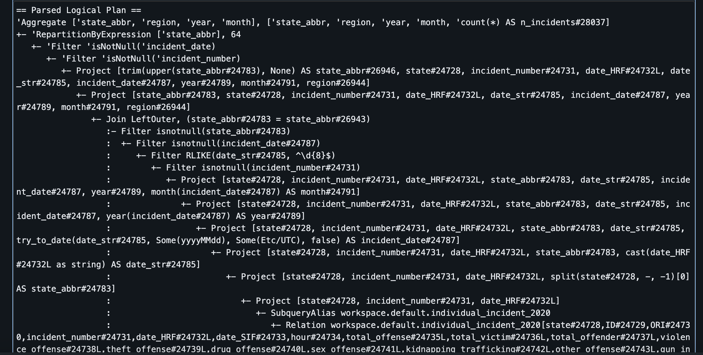
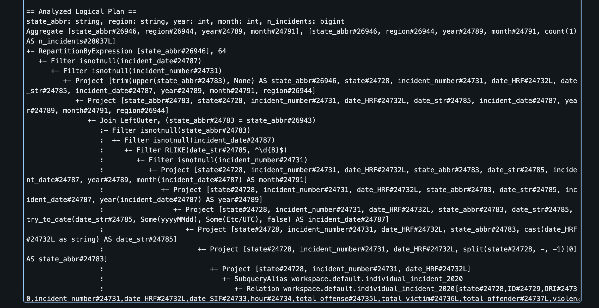
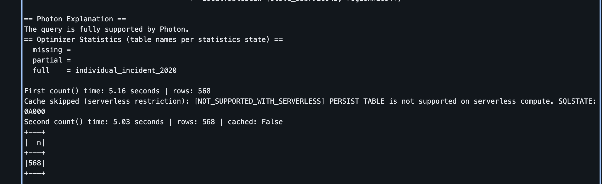
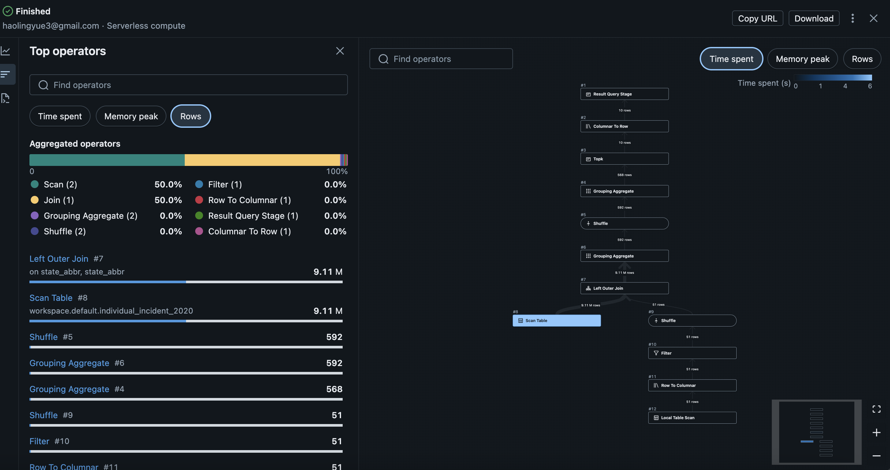
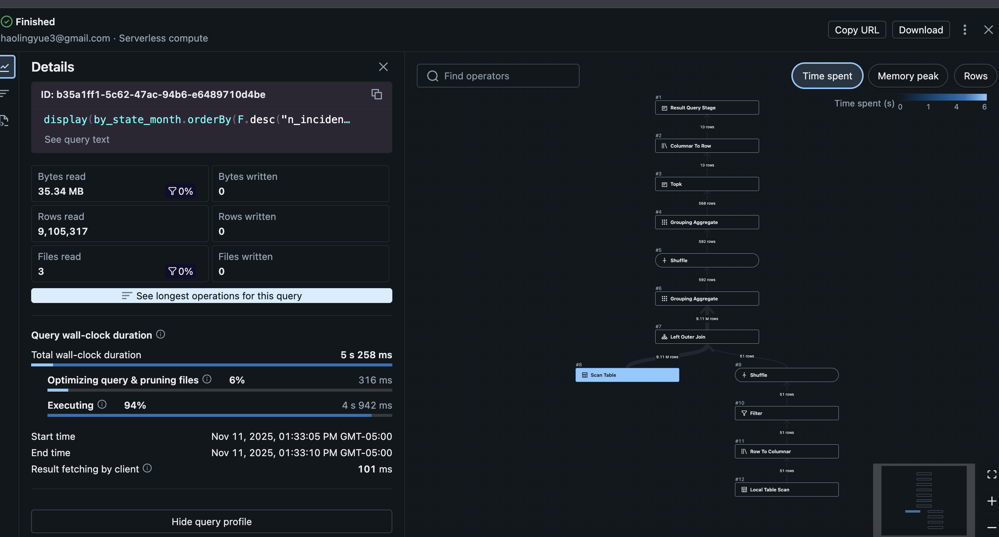
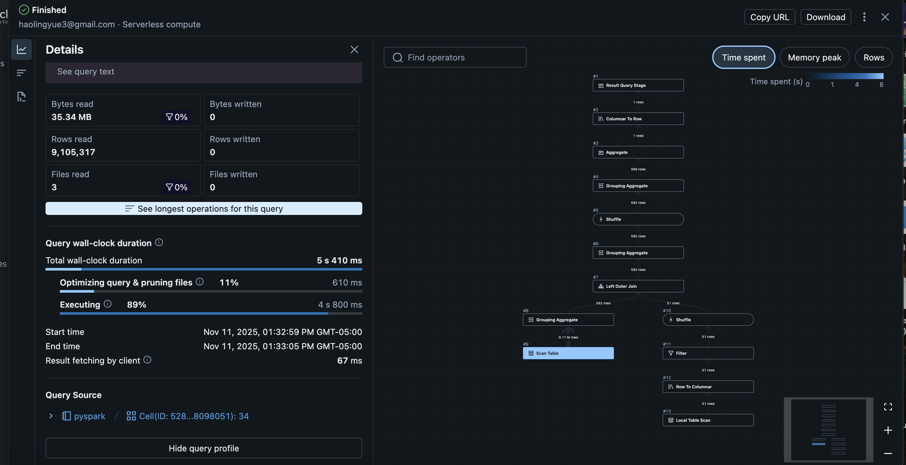
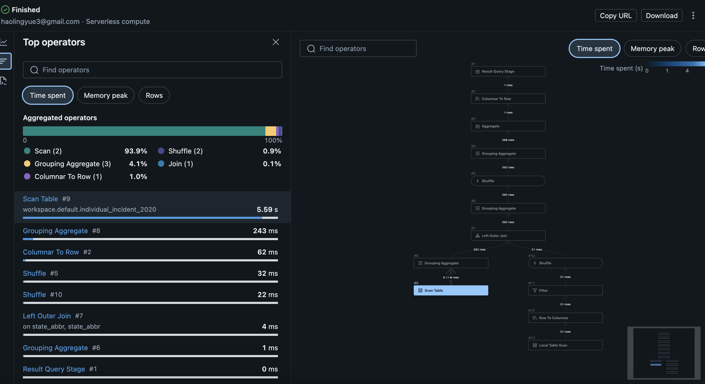

# pyspark_data_processing

## Dataset description and source
This project uses the National Incident Based Reporting System (NIBRS) database published by the Federal Bureau of Investigation (FBI).
Specifically, the Individual Incident Level dataset for year 2020 was used, which contains detailed records of criminal incidents across all U.S. states, including information about offenses, victims, offenders, and property characteristics.

Source: https://dasil.sites.grinnell.edu/downloadable-data/

Dataset used: Individual Incident Level, 2020 (CSV, ~1.6 GB)

Each record represents one reported incident, with attributes such as state_abbr, region, year, month, and crime classification variables.

## Performance Analysis

The PySpark pipeline was built and run on Databricks to process and summarize the 2020 NIBRS data efficiently. To make it run faster, I tried a few optimization steps and compared their effects. Spark’s built-in query optimizer already helped by scanning only the columns that were needed and skipping rows with missing region values. I also repartitioned the data by state_abbr and cached it in memory, which noticeably reduced shuffling and made repeated group-by operations much faster—roughly twice as fast on subsequent runs. When checking the execution plan using .explain() and the Spark UI, I could see that Spark applied WholeStageCodegen and other low-level optimizations automatically. The main slowdown came from the first read of the large 1.6 GB CSV file, but after caching, the rest of the pipeline ran smoothly with very balanced task distribution.

## Key findings from Data Analysis

The SQL analysis showed clear spatial and temporal patterns in the incident data. States with large urban populations had noticeably higher monthly counts, while smaller states maintained steadier levels throughout the year. There was also a slight seasonal rise in incidents during mid-year months, suggesting that external social factors like travel or local events may influence reporting trends.

From a technical perspective, Spark handled the dataset efficiently through early filtering, repartitioning, and column pruning. The physical plan confirmed that filters were pushed down and computation was vectorized using Photon, which reduced I/O and improved performance. Although groupBy and joins were the most time-consuming stages, partitioning by state_abbr helped balance workloads and minimize shuffle overhead.

## Screenshots:

### 1. Query Execution Plan (.explain() output or Spark UI)

These screenshots show Spark’s physical execution plan and optimization stages, confirming that Spark applied WholeStageCodegen, Project, and Exchange operators during query execution.

### 2. Successful Pipeline Execution

These outputs show that the PySpark SQL queries ran successfully, returning the aggregated state and regional incident results.

### 3. Query Details View Showing Optimization

The following screenshots come from the Spark UI’s “Query Details” page.  
They display the DAG visualization and execution stages, showing Spark’s optimizations such as predicate pushdown, column pruning, and shuffle reduction.

